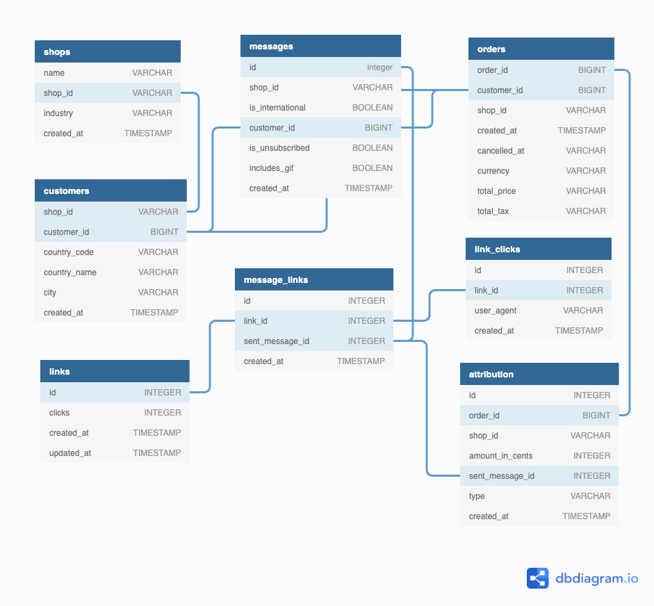

# Charlie Hahn's Postscript Take Home Assignment

This is the data exploration and analysis I've put together for the senior analyst role.

**List of Technologies Used:**
1. sqlpad gui (for data wrangling/analysis)
2. tableau (for data viz)

**Tableau Dashboard:**
- https://public.tableau.com/app/profile/charlie3118/viz/ps_dashboard/postscript_dash

**Canva Presentation:**
- https://www.canva.com/design/DAEkLLiKo0I/T1L_iARCLpWuIZg2W-1JoA/view?utm_content=DA[…]tm_campaign=designshare&utm_medium=link&utm_source=sharebutton

**Video Presentation:**
- https://www.loom.com/share/af4b570bdf5e41ac9a6320b96ae7ae60

**Roughly how long the project took**
- ERD Understanding + Creation: ~15 mins
- Research Postscript Business: ~1 hour
- EDA & Modeling: ~2 + hours
- Tableau: ~1+ hour
- Thinking in my sleep: ?
- Presentation: ~30 mins
- Video: ~10 mins
- **Total:** 4+ hours (I went over time! This project was just really fun to work on!)

**How to orchestrate delivery to production?**
- dbt to refine raw data from snowflake with staging, intermediate, and marts data models + schema and data tests
- Airflow to test and push refined data back into snowflake
- Snowflake to Looker integration to provide self-service analytics for all

<br>

# Entity Relationship Diagram
Using dbdiagram.io, I've created this ERD based off the provided datasets. Some light exploration was done to figure out the linkages.



# Exploratory Data Analysis

All data exploration and transformation was done using the `sqlpad` gui. I updated the `docker-compose.yml` and `makefile` to include this additional service.

<br>

```sql
-- Count total number of rows + null values in the shops table
select
  count(1)                       as total_row_count
  , count(name)                  as shop_name_count
  , count(shop_id)               as shop_id_count
  , count(industry)              as industry_count
  , count(created_at)            as created_at_count
from
  public.shops
```

| total_row_count | shop_name_count | shop_id_count | industry_count | created_at_count |
|-----------------|-----------------|---------------|----------------|------------------|
| 2000            | 2000            | 2000          | 1112           | 2000             |

<br>

```sql
-- Are there any duplicate shops?
select
  name
  , shop_id
  , count(1)              store_count
from
  public.shops
group by
  name
  , shop_id
having
  count(1) > 1
```
*Query finished. No duplicate rows returned*

<br>

```sql
-- Examine volume of postscript clients by industry
select
  lower(industry)           as industry_type
  , count(1)                as industry_count
from
  public.shops
group by
  industry_type
order by
  industry_count desc
```

| industry_type                                            | industry_count |
|----------------------------------------------------------|----------------|
| *null*                                                   | 888            |
| fashion & apparel                                        | 564            |
| beauty & cosmetics                                       | 183            |
| home goods & electronics                                 | 89             |
| health & wellness                                        | 85             |
| food & drink                                             | 55             |
| other: retail                                            | 5              |
| other: education                                         | 4              |
| other: pets                                              | 4              |
...
| other: cbd                                               | 1              |
| other: general merchandise                               | 1              |
| other: digital files                                     | 1              |
| other: service industry                                  | 1              |

**Observation:**
44% (888/2000) of industry values are missing in the `shop` table, which is a sizable amount. As a result, I'd be wary of using this data to create industry average values and/or comparing any one store against aforementioned industry averages.

<br>

```sql
-- Count total number of rows + null values in the customers table
select
  count(1)                       as total_row_count
  , count(shop_id)               as shop_id_count
  , count(customer_id)           as customer_id_count
  , count(country_name)          as country_name_count
  , count(city)                  as city_count
from
  public.customers
```
| total_row_count | shop_id_count | customer_id_count | country_name_count | city_count |
|-----------------|---------------|-------------------|--------------------|------------|
| 2922            | 2922          | 2922              | 2703               | 2704       |

<br>

```sql
-- Are there any duplicate customers? no
select
  count(1)                              as total_customer_count
  , count (distinct customer_id)        as distinct_customer_count
from
  public.customers
```
|total_customer_count | distinct_customer_count |
|---------------------|-------------------------|
|2922                 | 2922                    |

<br>

```sql
-- How many customers per shop?
select
  customers.shop_id
  , shops.name
  , shops.industry
  , count(distinct customer_id)          as unique_customers
from
  public.customers
left join public.shops
  on customers.shop_id = shops.shop_id
group by
  customers.shop_id
  , shops.name
  , shops.industry
order by
  unique_customers desc
```

| shop_id                          | name                              | industry                    | unique_customers |
|----------------------------------|-----------------------------------|-----------------------------|------------------|
| 3394befcb88e77fc9d524196b6b2b19a | Stanton, Duncan and James         |                             | 272              |
| 82f817f045ab9ed53a8744ea4a9fd15d |                                   |                             | 78               |
| df939aead64bda9508644c48974dc7b6 |                                   |                             | 50               |
| 8c976fffeb682e98044d2442a7f774ef | Brown-Anderson                    |                             | 42               |
| e91b45560f45608e4b211e36c39726b3 | Wise, Davis and Thompson          | Home Goods & Electronics    | 37               |
| 5e3606eee64c7f57a4539623ce048fdb | King PLC                          |                             | 32               |
...
| c16a417a73ec4bfb4f2b67c20da1689f |                                   |                             | 3                |
| c1b3fd29caca48ee6a25664b4f6c6562 | Cooley-Morgan                     | Fashion & Apparel           | 3                |
| 7418d763846f4db6a78a9d94812aefd1 | Johnson-Campbell                  | Fashion & Apparel           | 3                |
| 2bf424b789cc7629dad1230d397e876d | Zuniga-Johnson                    |                             | 3                |
| 08b9636a8f465b96bc20a7afd5566120 | Cruz Ltd                          |                             | 3                |
| 7cec05345b4115fa36d2a8caf0cfdb0e | Hicks, Patrick and Hunter         |                             | 3                |
| 4e62a2920da3a344fa9982f442780309 |                                   |                             | 3                |
| d9ce2e7908f4307c62145bf6e9c60bf8 |                                   |                             | 3                |
| dc80f576c90a455573c3f417996f2e19 | Foster-Sanchez                    | Food & Drink                | 3                |
| 86ba9c869a043b4200dad51da53290c7 |                                   |                             | 3                |
| 8fa4c250b75256cfef57f8f00100ffbd |                                   |                             | 1                |
| 90732a1f69b6d106387b3dd42bfa6de6 | Williams-Blankenship              |                             | 1                |
| 927d89ef12a2b6a3ee484591f54566a1 | Nguyen-Hansen                     | Fashion & Apparel           | 1                |
| 9281cdf1234fc4fa865eb3150477d41b |                                   |                             | 1                |
| 931b7d05fb0914162ccabc3c925b0571 |                                   |                             | 1                |
| 93b10c333b8fe22406f20d76a43c9484 | Young Ltd                         |                             | 1                |

<br>

```sql
-- How many shops can a customer belong to?
with num_shops_per_customer as (

  select
    customer_id
    , count(distinct shop_id)     as unique_shop_count
  from
    public.customers
  group by
    customer_id

)

select
  unique_shop_count
  , count(1)                      as customer_count
from
  num_shops_per_customer
group by
  unique_shop_count
order by
  unique_shop_count

--each customer only belongs to 1 shop
```

| unique_shop_count | customer_count |
|-------------------|----------------|
| 1                 | 2922           |

<br>

```sql
-- Are there are any duplicate records in messages table for id column?
select
  id
  , count(*)            as record_count
from
  messages
group by
  id
having
  count(*) > 1
```
*Query finished. No duplicate rows returned*

<br>

```sql
-- How many customers receive messages?
-- Only 406 out of 2,922 get messages (~13%)!
select
  count(distinct customer_id) as unique_customers
from
  messages
```
| unique_customers |
|------------------|
| 406              |

<br>

```sql
-- How many messages do customers receive?
with num_messages_sent as (

  select
    customer_id
    , count(distinct id)      as number_of_unique_messages
  from
    public.messages
  group by
    customer_id

)

select
  number_of_unique_messages
  , count(1)                  as number_of_customers
from
  num_messages_sent
group by
  number_of_unique_messages
order by
  number_of_unique_messages
```

| number_of_unique_messages | number_of_customers |
|---------------------------|---------------------|
| 1                         | 169                 |
| 2                         | 46                  |
| 3                         | 36                  |
| 4                         | 22                  |
| 5                         | 26                  |
| 6                         | 22                  |
| 7                         | 12                  |
| 8                         | 8                   |
| 9                         | 8                   |
| 10                        | 6                   |
| 11                        | 3                   |
| 12                        | 4                   |
| 13                        | 4                   |
| 14                        | 3                   |
| 15                        | 5                   |
| 16                        | 2                   |
| 17                        | 2                   |
| 18                        | 3                   |
| 19                        | 2                   |
| 20                        | 2                   |
| 21                        | 1                   |
| 24                        | 2                   |
| 25                        | 1                   |
| 26                        | 2                   |
| 27                        | 1                   |
| 28                        | 1                   |
| 30                        | 1                   |
| 31                        | 2                   |
| 34                        | 1                   |
| 41                        | 1                   |
| 44                        | 1                   |
| 53                        | 1                   |
| 60                        | 1                   |
| 61                        | 1                   |
| 80                        | 1                   |
| 81                        | 1                   |
| 82                        | 1                   |
| 117                       | 1                   |
| 607                       | 1                   |

<br>

```sql
-- What is the segmentation of customer messages?
select
  is_international,
  is_unsubscribed,
  includes_gif,
  count(*)             as message_count
from
  public.messages
group by
  1,
  2,
  3
order by
  is_international
```

| is_international | is_unsubscribed | includes_gif | message_count |
|------------------|-----------------|--------------|---------------|
| FALSE            | TRUE            | TRUE         | 2             |
| FALSE            | FALSE           | TRUE         | 528           |
| FALSE            | FALSE           | FALSE        | 2421          |
| FALSE            | TRUE            | FALSE        | 7             |
| TRUE             | FALSE           | FALSE        | 1             |
| *null*           | FALSE           | TRUE         | 4             |
| *null*           | FALSE           | FALSE        | 37            |

<br>

```sql
--How many customers ordered without being messaged?
select
  count(1) - count(order_id)    as customers_who_ordered_without_messages
  , count(1)                    as customers_who_ordered_with_messages
from
  messages
left join orders
  on messages.customer_id = orders.customer_id
```

| customers_who_ordered_without_messages | customers_who_ordered_with_messages |
|----------------------------------------|------------------------------------|
| 451                                    | 3000                               |

<br>

```sql
-- How many customers make orders?
--1996 customers make orders
select
  count(distinct customer_id)       as unique_customers
from
  orders
```
| unique_customers |
|------------------|
| 1,996            |

<br>

```sql
-- How many cancelled orders?
select
  count(*)          as cancelled_order_count
from
  orders
where
  cancelled_at is not null
```
| cancelled_order_count  |
|------------------------|
| 7                      |


<br>

```sql
-- How many messages appear in the attribution table?
-- Only 81 records
select
  count(distinct sent_message_id)     as unique_messages
from
  attribution
```

| unique_messages  |
|------------------|
| 81               |

<br>

```sql
-- Are there shops with attributed sales but not sending messages?
-- Yes there are 22 shops that don't send messages but are getting attributed sales
-- Something weird is going on with the attribution table....

with attributed_shops_without_messages as (

  select
    attribution.shop_id            as attribution_shop_id
    , shops.name                   as shop_name
    , attribution.order_id
    , attribution.amount_in_cents
    , type                         as click_vs_view
    , messages.shop_id             as messages_shop_id
    , customer_id
  from
    attribution
  left join messages
    on attribution.sent_message_id = messages.id
  left join shops
    on attribution.shop_id = shops.shop_id
  where
    messages.id is null

)

select
  shop_name
  , count(*)
from
  attributed_shops_without_messages
group by
  1
order by
  count(*) desc
```

| shop_name                      | count |
|--------------------------------|-------|
| *null*                         | 36    |
| Stanton, Duncan and James      | 6     |
| Jones, Griffith and Lewis      | 4     |
| White Ltd                      | 3     |
| King PLC                       | 2     |
| Cummings, Marquez and Stephens | 2     |
| Greer Group                    | 1     |
| Harris, Matthews and Taylor    | 1     |
| Herman, Trujillo and Anderson  | 1     |
| Herrera, Allen and Morse       | 1     |
| Bailey Group                   | 1     |
| Mccarthy-Morris                | 1     |
| Mccoy, Alvarez and Garner      | 1     |
| Owens-Oliver                   | 1     |
| Robinson, Myers and Williams   | 1     |
| Smith Group                    | 1     |
| Bryan, Martin and Hernandez    | 1     |
| Stout, Crawford and James      | 1     |
| Young Inc                      | 1     |
| Buchanan, Bradley and Jones    | 1     |
| Brown-Anderson                 | 1     |
| Chang-Shaw                     | 1     |
| Graves-Harris                  | 1     |


<br>

```sql
-- How many links have clicks - and how many?
select
  clicks
  , count(*)            as number_of_clicks
from
  links
group by
  1
order by
  1

-- For example, 3,652 links have 0 clicks
```

| clicks | number_of_clicks |
|--------|------------------|
| 0      | 3652             |
| 1      | 404              |
| 2      | 46               |
| 3      | 19               |
| 4      | 7                |
| 5      | 6                |
| 6      | 1                |
| 7      | 1                |
| 8      | 1                |
| 9      | 1                |
| 12     | 1                |

<br>

```sql
-- Can a message have more than 1 link?
select
  sent_message_id
  , count(*)
from
  message_links
group by
  1
order by
  2 desc

-- Yes, there can be  multiple links in a message
```

<br>

```sql
-- How many shops send messages (i.e are active postscript customers?)
with shop_segment as (

  select
    shops.shop_id
    , shops.name

    , case
        when count(messages.*) > 0
          then 'Active'
        else 'Inactive'
      end                                   as postscript_subscription_type

  from
    shops
  left join messages
    on shops.shop_id = messages.shop_id
  group by
    shops.name
    , shops.shop_id

)

select
  postscript_subscription_type
  , count(*)                as shop_count
from
  shop_segment
group by
  1
```
| postscript_subscription_type | shop_count |
|------------------------------|------------|
| Active                       | 55         |
| Inactive                     | 1945       |

<br>

```sql
-- What are the min and max number of messages sent in any given month by any shop?
with monthly_shop_messages as (
  select
    date_trunc('month', created_at) as month
    , shop_id
    , count(*) as message_count
  from
    messages
  group by
    1
    , 2
)

select
  min(message_count)        as min_message_count
  , max(message_count)      as max_message_count
from
  monthly_shop_messages
```
| min_message_count | max_message_count |
|-------------------|-------------------|
| 1                 | 190               |

<br>

```sql
-- Any customers who get messaged by more than one shop? no
select
  customer_id
  , count(distinct shop_id)         as unique_shop_count
from
  messages
group by
  1
having
  count(distinct shop_id) > 1
```

<br>

```sql
-- How many customers get targeted with more than one message?
with multiple_messages as (

  select
    customers.customer_id
    , count(id)                     as message_count
  from
    customers
  left join messages
    on customers.customer_id = messages.customer_id
  group by
    customers.customer_id

)

select
  count(*)            as customer_count
from
  multiple_messages
where
  message_count > 1
```

| customer_count |
|----------------|
| 237            |


<br>

```sql
-- Any customers who have more than one order? no
select
  customers.customer_id
  , count(*)
from
  customers
left join orders
  on customers.customer_id = orders.customer_id
group by
  1
having
  count(*) > 1
```
*Query finished. No rows returned*

<br>


# Staging Models

### In an ideal world, I would create dbt staging models for each of these ctes separately

<br>

```sql
-- Create staging layer models to modify raw data columns as needed
with stg_shops as (

  select
    name                                  as shop_name
    , shop_id
    , industry
    , created_at                          as shop_created_date
  from
    shops

)

, stg_customers as (

  select
    shop_id
    , customer_id
    , country_code
    , country_name
    , city
    , created_at                          as customer_created_date
  from
    customers

)

, stg_links as (

  select
    id                                    as link_id
    , clicks                              as link_clicks
    , created_at                          as link_created_date
    , updated_at                          as link_updated_date
  from
    links

)

, stg_link_clicks as (

  select
    id                                    as link_click_id
    , link_id
    , user_agent
    , created_at                          as link_click_date
  from
    link_clicks

)

, stg_messages as (

  select
    id                                    as sent_message_id
    , shop_id
    , is_international
    , customer_id
    , is_unsubscribed
    , includes_gif
    , created_at                          as message_sent_date
  from
    messages

)

, stg_message_links as (

  select
    id                                    as message_link_id
    , link_id
    , sent_message_id
    , created_at                          as message_link_created_date
  from
    message_links

)

, stg_orders as (

  select
    order_id
    , customer_id
    , shop_id
    , created_at                          as order_date
    , cancelled_at                        as cancelled_date
    , currency
    , total_price
    , coalesce(total_tax::float, 0)       as total_tax

    , cast(total_price as float)
        + coalesce(total_tax::float, 0)   as total_sales

  from
    orders

)

, stg_attribution as (

  select
    id                                    as attribution_id
    , order_id
    , shop_id
    , amount_in_cents::float/100          as attributed_sales
    , sent_message_id
    , type                                as click_vs_view
    , created_at                          as attribution_date
  from
    attribution

)
```

<br>

# More EDA from Staging
```sql
-- referencing the staging layer models for further EDA
with joint as (

  select
    stg_shops.shop_id
    , stg_shops.shop_name
    , stg_shops.industry
    , stg_shops.shop_created_date
    , stg_customers.customer_id
    , stg_customers.country_code
    , stg_customers.country_name
    , stg_customers.city
    , stg_customers.customer_created_date
    , stg_links.link_id
    , stg_links.link_clicks
    , stg_links.link_created_date
    , stg_links.link_updated_date
    , stg_messages.sent_message_id
    , stg_messages.shop_id
    , stg_messages.is_international
    , stg_messages.is_unsubscribed
    , stg_messages.includes_gif
    , stg_messages.message_sent_date
    , stg_message_links.message_link_id
    , stg_message_links.message_link_created_date
    , stg_link_clicks.link_click_id
    , stg_link_clicks.user_agent
    , stg_link_clicks.link_click_date
    , stg_orders.order_id
    , stg_orders.order_date
    , stg_orders.cancelled_date
    , stg_orders.currency
    , stg_orders.total_price
    , stg_orders.total_tax
    , stg_orders.total_sales
    , stg_attribution.attribution_id
    , stg_attribution.attributed_sales
    , stg_attribution.click_vs_view
    , stg_attribution.attribution_date
  from
    stg_customers
  left join stg_shops
    on stg_customers.shop_id = stg_shops.shop_id
  left join stg_messages
    on stg_customers.customer_id = stg_messages.customer_id
  left join stg_message_links
    on stg_messages.sent_message_id = stg_message_links.sent_message_id
  left join stg_links
    on stg_message_links.link_id = stg_links.link_id
  left join stg_link_clicks
    on stg_links.link_id = stg_link_clicks.link_id
  left join stg_orders
    on stg_customers.customer_id = stg_orders.customer_id
  left join stg_attribution
    on stg_orders.order_id = stg_attribution.order_id

)

, shop_to_customer_order_sequence as (

  select
      customer_id
    , shop_created_date
    , customer_created_date
    , link_created_date
    , message_sent_date
    , message_link_created_date
    , link_click_date
    , order_date
    , attribution_date
    , shop_created_date < customer_created_date
      and customer_created_date < link_created_date
      and link_created_date < message_sent_date
      and message_sent_date < message_link_created_date
      and message_link_created_date < link_click_date
      and link_click_date < order_date
      and order_date < attribution_date                    as is_sequential_flag
  from
    joint

)

select
  *
from
  shop_to_customer_order_sequence

where 1=1

-- testing various dates sequences:

-- 1. are shops always created before customers? yes
--  and shop_created_date > customer_created_date

-- 2. do customers get created before messages are sent? yes
--  and message_sent_date < customer_created_date

-- 3. do links always come before messages? yes
--  and stg_links.link_created_date > stg_messages.message_sent_date

-- 4. do links always come before link clicks? yes
--  and stg_links.link_created_date > stg_link_clicks.link_click_date

-- 5. do messages always come before message links? yes
--  and message_sent_date > message_link_created_date

-- 6. do orders ever come before links are created? yes there are 2,178 of these orders
--  and stg_orders.order_date < stg_links.link_created_date -- 2,178 orders where orders come before links created
--  and stg_orders.order_date > stg_links.link_created_date -- 626 orders where orders come after links created
-- but keeping in mind, links to orders are many to one and aren't directly mapped 1:1.

-- 7. does the attribution timestamp ever come before the order date? no
--  and stg_attribution.attribution_date < stg_orders.order_date
```

<br>

General flow of customer purchase journey (with exceptions):
1. shop subscribes for postscript `shops`
2. customers profiles get set up in each shop `customers`
3. shops send messages to customers `messages`
4. message links are viewed and/or clicked by customers `link_clicks`
5. customers purchase orders `orders`
6. order is attributed to a postscript marketing message `attribution`


<br>

```sql
-- Looking at a random customer journey

select * from customers where customer_id = '3564155306032'
-- customer created date = 2020-11-27 01:01:49.000

select * from orders where customer_id = '3564155306032'
-- order_date = 2020-12-10 05:13:08.000

select * from attribution where order_id = '2598491029552'
-- attribution date = 2020-12-10 05:15:40.642

select * from message_links where sent_message_id = '428135464'
-- message link sent on 2020-12-05 18:05:09.834

select * from messages where id = '428135464'
-- message sent on 2020-12-05 18:05:09.714

select * from links where id = '423762469'
-- link created on 2020-12-05 18:05:09.685

select * from link_clicks where link_id = '423762469'
-- link clicked on 2020-12-10 02:07:10.346
```

Order of operations for `customer_id` = '3564155306032':
- `customer created` = 2020-11-27 01:01:49.000  from customers table
- `link created` = 2020-12-05 18:05:09.685 from links table
- `sent_message_date` = 2020-12-05 18:05:09.714  from messages table
- `sent_message_link_date` = 2020-12-05 18:05:09.834  from message_links table
- `link clicked` on =  2020-12-10 02:07:10.346 from links_clicks table
- `order_date` = 2020-12-10 05:13:08.000  from orders table
- `attributed_date` = 2020-12-10 05:15:40.642 from attribution table

<br>


```sql
-- Are there any orders that aren't being attributed?
-- This was a rough attempt at identifying non-attributed orders
-- But realized there is no way to accurately identify this with the given information

with attribution_window as (

  select
    date_part('day', order_date - link_click_date)                     as days_in_attribution_window
    , stg_orders.order_date
    , stg_link_clicks.link_click_date
    , stg_orders.customer_id
    , stg_orders.order_id
    , stg_orders.currency
    , stg_orders.total_sales
    , stg_link_clicks.link_id
  from
    stg_messages
  left join stg_message_links
    on stg_messages.sent_message_id = stg_message_links.sent_message_id
  left join stg_link_clicks
    on stg_message_links.link_id = stg_link_clicks.link_id
  left join stg_orders
    on stg_messages.customer_id = stg_orders.customer_id
  where
    date_part('day', order_date - link_click_date) between 0 and 7

)

, link_click_order as (

  select

    row_number() over (
      partition by
        customer_id
      order by
        days_in_attribution_window desc
        , link_click_date desc)                       as click_sequence_order

    , attribution_window.*

  from
    attribution_window

)

, last_click as (

  select
    *
  from
    link_click_order
  where
    click_sequence_order = 1

)

select
  *
from
  last_click
where
    not exists (select
                    1
                from
                    stg_attribution
                where
                    last_click.order_id = stg_attribution.order_id)
```

| click_sequence_order | days_in_attribution_window | order_date               | link_click_date          | customer_id | order_id    | currency | total_sales | link_id   |
|----------------------|----------------------------|--------------------------|--------------------------|-------------|-------------|----------|-------------|-----------|
| 1                    | 7                          | 2020-07-15T13:59:41.000Z | 2020-07-07T23:27:08.631Z | 9.06275E+11 | 2.38716E+12 | USD      | 85.97       | 165779689 |
| 1                    | 0                          | 2020-10-06T16:22:16.000Z | 2020-10-07T15:09:01.783Z | 1.1217E+12  | 2.48366E+12 | USD      | 102.07      | 279293984 |

<br>

# **Intermediate/Marts Models**

```sql
with monthly_shop_orders as (

  select
    date_trunc('month', stg_orders.order_date)              as order_month
    , stg_shops.shop_id
    , stg_shops.shop_name
    , count(*)                                              as order_count
    , sum(total_sales)                                      as sales_total
  from
    stg_orders
  left join stg_shops
    on stg_orders.shop_id = stg_shops.shop_id
  group by
    1
    , 2
    , 3

)

, monthly_shop_messages as (

  select
    date_trunc('month', stg_messages.message_sent_date)        as message_sent_month
    , stg_shops.shop_id
    , stg_shops.shop_name
    , count(case when includes_gif then 1 end)                 as mms_message_count
    , count(case when not includes_gif then 1 end)             as sms_message_count
    , count(*)                                                 as message_count

  from
    stg_messages
  left join stg_shops
    on stg_messages.shop_id = stg_shops.shop_id
  group by
    1
    , 2
    , 3

)

, monthly_shop_stats as (

  select
    coalesce(monthly_shop_orders.order_month
                , monthly_shop_messages.message_sent_month)     as transaction_month

    , coalesce(monthly_shop_orders.shop_id
                , monthly_shop_messages.shop_id)                as shop_id

    , coalesce(monthly_shop_orders.shop_name
                , monthly_shop_messages.shop_name)              as shop_name

    , sales_total
    , order_count
    , message_count
  from
    monthly_shop_orders
  full outer join monthly_shop_messages
    on monthly_shop_orders.order_month = monthly_shop_messages.message_sent_month
    and monthly_shop_orders.shop_id = monthly_shop_messages.shop_id
  order by
    transaction_month

)

, monthly_message_cost as (

  select
    stg_shops.shop_id
    , stg_shops.shop_name
    , message_sent_month
    , count(*)                                              as month_count
    , sum(monthly_shop_messages.mms_message_count)          as total_mms_sent
    , sum(monthly_shop_messages.sms_message_count)          as total_sms_sent


    -- estimating postscript's monthly revenue per message sent by shops
    -- per the pricing link here: https://www.postscript.io/pricing/

    -- MMS is considered 3 points
    -- SMS is considered 1 point

    -- monthly MMS cost = total MMS messages x 3
    -- monthly SMS cost = total SMS messages

    -- no shops with more than 190 messages/month, so won't expand on below logic beyond 2500 msgs
    , case
        when sum(mms_message_count) * 3 > 0
          and sum(mms_message_count) * 3 <= 2500
            then 25
        when sum(sms_message_count) > 0
          and sum(mms_message_count) <= 2500
            then 25
        else 0
      end                                                   as message_cost

  from
    monthly_shop_messages
  left join stg_shops
    on monthly_shop_messages.shop_id = stg_shops.shop_id
  group by
    1
    , 2
    , 3

)

, total_message_costs as (

  select
    shop_id
    , shop_name

    -- the number of months a shop has subscribed to Postscript
    , sum(month_count)                      as number_of_months

    , sum(message_cost)                     as total_cost
  from
    monthly_message_cost
  group by
    1
    , 2

)

-- Though 7 day attribution is the norm
-- taking 30-day attribution window to look at macro impact of postscript messages on orders made
, all_time_correlation as (

  select
    shop_id
    , shop_name
    , corr(order_count, message_count)             as messages_to_orders_correlation
    , regr_r2(order_count, message_count)          as messages_to_orders_r_squared
  from
    monthly_shop_stats
  group by
    1
    , 2

  -- inspecting any shops that have a positive and mildly strong correlation
  -- having
  --   corr(order_count, message_count) > .5

)

, all_time_message_stats as (

  select
    stg_shops.shop_id
    , stg_shops.shop_name
    , count(case when includes_gif then 1 end)                  as mms_message_count
    , count(case when not includes_gif then 1 end)              as sms_message_count
    , count(*)                                                  as messages_sent_count
    , count(case when not is_unsubscribed then 1 end)           as subscribed_count
    , count(case when is_unsubscribed then 1 end)               as unsubscribed_count
    , count(is_unsubscribed)                                    as total_sub_type_count

    , count(case when not is_unsubscribed then 1 end) * 1.0 /
        count(is_unsubscribed) * 1.0                            as subscribed_rate

    , count(case when is_unsubscribed then 1 end) * 1.0 /
        count(is_unsubscribed) * 1.0                            as unsubscribed_rate

  from
    stg_messages
  left join stg_shops
    on stg_messages.shop_id = stg_shops.shop_id
  group by
    1
    , 2

)

, all_time_attributed_sales as (

  select
    stg_shops.shop_id
    , stg_shops.shop_name
    , sum(attributed_sales)                           as total_attributed_sales
  from
    stg_attribution
  left join stg_shops
    on stg_attribution.shop_id = stg_shops.shop_id
  group by
    1
    , 2

)

-- # days it takes a customer to order from the day they were created in the shop's database
, days_to_order as (

  select
    stg_shops.shop_id
    , stg_shops.shop_name
    , date_part('day', order_date - customer_created_date)        as days_to_order
  from
    stg_customers
  left join stg_orders
    on stg_customers.customer_id = stg_orders.customer_id
  left join stg_shops
    on stg_customers.shop_id = stg_shops.shop_id

)

, avg_days_to_order as (

  select
    shop_id
    , shop_name
    , avg(days_to_order)            as avg_days_to_order
  from
    days_to_order
  group by
    1
    , 2

)

, all_time_link_clicks as (

  select
    stg_shops.shop_id
    , stg_shops.shop_name
    , count(stg_link_clicks.link_click_id)                  as link_click_count
  from
    stg_link_clicks
  left join stg_message_links on
    stg_link_clicks.link_id = stg_message_links.link_id
  left join stg_messages
    on stg_message_links.sent_message_id = stg_messages.sent_message_id
  left join stg_shops
    on stg_messages.shop_id = stg_shops.shop_id
  group by
    1
    , 2

)

, all_time_order_stats as (

  select
    stg_shops.shop_id
    , stg_shops.shop_name
    , sum(total_sales)                          as total_sales
    , count(order_id)                           as order_count
    , sum(total_sales) / count(order_id)        as average_order_value
  from
    stg_orders
  left join stg_shops
    on stg_orders.shop_id = stg_shops.shop_id
  where
    cancelled_date is null
  group by
    1
    , 2

)

, total_customer_base as (

  select
    stg_shops.shop_id
    , stg_shops.shop_name
    , count(customer_id)                            as customer_count
  from
    stg_shops
  left join stg_customers
    on stg_shops.shop_id = stg_customers.shop_id
  group by
    1
    , 2

)

, intermediate_facts_table as (

  select
    total_customer_base.shop_id
    , total_customer_base.shop_name
    , total_customer_base.customer_count
    , total_message_costs.number_of_months
    , total_message_costs.total_cost
    , all_time_message_stats.unsubscribed_rate
    , all_time_message_stats.sms_message_count
    , all_time_message_stats.mms_message_count
    , all_time_message_stats.messages_sent_count
    , all_time_link_clicks.link_click_count
    , link_click_count * 1.0 / messages_sent_count * 1.0         as click_through_rate
    , all_time_order_stats.order_count
    , order_count * 1.0 / link_click_count * 1.0                 as order_conversion_rate
    , all_time_order_stats.total_sales
    , all_time_order_stats.average_order_value
    , avg_days_to_order.avg_days_to_order
    , total_attributed_sales
    , total_sales / messages_sent_count                          as earnings_per_message
    , (total_sales - total_cost) / total_sales                   as return_on_investment

    , case
        when all_time_message_stats.messages_sent_count is null
          then 'Inactive'
        else 'Active'
      end                                                        as postscript_subscription_type

    -- correlation between messages sent and orders made
    , messages_to_orders_correlation
    , messages_to_orders_r_squared

  from
    total_customer_base
  left join all_time_order_stats
    on total_customer_base.shop_id = all_time_order_stats.shop_id
  left join all_time_link_clicks
    on total_customer_base.shop_id = all_time_link_clicks.shop_id
  left join avg_days_to_order
    on total_customer_base.shop_id = avg_days_to_order.shop_id
  left join all_time_attributed_sales
    on total_customer_base.shop_id = all_time_attributed_sales.shop_id
  left join all_time_message_stats
    on total_customer_base.shop_id = all_time_message_stats.shop_id
  left join total_message_costs
    on total_customer_base.shop_id = total_message_costs.shop_id
  left join all_time_correlation
    on total_customer_base.shop_id = all_time_correlation.shop_id

)
```

<br>

# Final Model Ouptut
```sql
with final_facts_table as (

--TODO : create intermediate shop table where shops with 0 customers are filtered out

  select
    *
  from
    intermediate_facts_table
  where
    customer_count > 0

)

select
  *
from
  final_facts_table
```
**Sample Output:**
| shop_id                          | shop_name                   | customer_count | unsubscribed_rate | number_of_months | total_cost | messages_sent_count | link_click_count | click_through_rate | order_count | order_conversion_rate | total_sales | average_order_value | avg_days_to_order | total_attributed_sales | earnings_per_message | return_on_investment | postscript_subscription_type | messages_to_orders_correlation | messages_to_orders_r_squared |
|----------------------------------|-----------------------------|----------------|-------------------|------------------|------------|---------------------|------------------|--------------------|-------------|-----------------------|-------------|---------------------|-------------------|------------------------|----------------------|----------------------|------------------------------|--------------------------------|------------------------------|
| 004d92c66f8df4cbb8ed8104f4dbf90b | Mills, Sullivan and Conway  | 6              |                   |                  |            |                     |                  |                    | 6           |                       | 367.83      | 61.305              | 45.5              |                        |                      |                      | Inactive                     |                                |                              |
| 012c184ac3d9a199aef516b813150706 | Franco Group                | 12             | 0                 | 6                | 150        | 12                  | 5                | 0.416666667        | 11          | 2.2                   | 99.94       | 9.085454545         | 341.9090909       |                        | 8.328333333          | -0.50090054          | Active                       |                                |                              |
| 022f85c0ef25f51501c1e01ac7c5f15d | Brown-Hawkins               | 1              |                   |                  |            |                     |                  |                    | 1           |                       | 14.9        | 14.9                | 0                 |                        |                      |                      | Inactive                     |                                |                              |
| 023164bdeba7c945c4a56a75afa34ee1 | Ortega, Stokes and Martin   | 1              |                   |                  |            |                     |                  |                    | 1           |                       | 29.89       | 29.89               | 0                 |                        |                      |                      | Inactive                     |                                |                              |
| 03b834d991adb7351e96f60a576acdd8 | Lopez, Campbell and Flores  | 4              | 0                 | 14               | 350        | 18                  | 17               | 0.944444444        | 4           | 0.235294118           | 344.38      | 86.095              | 103.5             |                        | 19.13222222          | -0.016319182         | Active                       |                                |                              |
| 047ac4e47aa4906bb1751aae151b58d9 | Chaney, Lowery and Fox      | 2              |                   |                  |            |                     |                  |                    | 2           |                       | 611.03      | 305.515             | 35.5              |                        |                      |                      | Inactive                     |                                |                              |
| 05dc24f155a736eca34742b9da102c70 | Harrison-Hodges             | 2              | 0                 | 2                | 50         | 3                   | 1                | 0.333333333        | 2           | 2                     | 50.22       | 25.11               | 423.5             |                        | 16.74                | 0.004380725          | Active                       |                                |                              |
| 0602441dbdc5ff2f290cb2780c0f5d2b | Doyle Inc                   | 1              |                   |                  |            |                     |                  |                    | 1           |                       | 53.97       | 53.97               | 0                 |                        |                      |                      | Inactive                     |                                |                              |
| 06f98765a3293e796f3b60a02b7f6e13 | Robertson-Nelson            | 1              |                   |                  |            |                     |                  |                    | 1           |                       | 29.4        | 29.4                | 0                 |                        |                      |                      | Inactive                     |                                |                              |
| 07a65ff5cf5c8d41704bbe04164e473f | Perry, Fowler and Wong      | 1              |                   |                  |            |                     |                  |                    | 1           |                       | 40          | 40                  | 0                 |                        |                      |                      | Inactive                     |                                |                              |
| 0886b3745ff6d34571a0306ff077562b | Hudson, Clark and Alexander | 3              |                   |                  |            |                     |                  |                    | 3           |                       | 81.77       | 27.25666667         | 0                 |                        |                      |                      | Inactive                     |                                |                              |
| 08b9636a8f465b96bc20a7afd5566120 | Cruz Ltd                    | 3              | 0                 | 1                | 25         | 1                   |                  |                    | 1           |                       | 22.53       | 22.53               | 905               |                        | 22.53                | -0.109631602         | Active                       |                                |                              |
| 0a4c88c8ff5b2cf08c111622037cb17f | Jones-Jordan                | 1              |                   |                  |            |                     |                  |                    | 1           |                       | 29.99       | 29.99               | 0                 |                        |                      |                      | Inactive                     |                                |                              |
| 0cfe6bd5c7b4fd6e96e8e85a1522c44a | Kaiser and Sons             | 1              |                   |                  |            |                     |                  |                    | 1           |                       | 834         | 834                 | 450               |                        |                      |                      | Inactive                     |                                |                              |
| 0f08cec58c7fb12ca82d185592e7a424 | White Ltd                   | 9              | 0                 | 22               | 550        | 388                 | 96               | 0.24742268         | 8           | 0.083333333           | 919.4       | 114.925             | 385.125           | 685.15                 | 2.369587629          | 0.401783772          | Active                       | 0.071102825                    | 0.005055612                  |

<br>

# Appendix

**Given more time I would look deeper into the following:**
- How do shops compare to the industry average as an index for sales/messages/click through/attribution etc

- Add customer level data so stores can see which customer is giving the highest ROI to create custom-tailored retargeting strategies

- Look at on average, how long did it take a customer to click on a link after receiving a message?

- Why are there multiple clicks? Do more clicks lead to higher attribution rates or conversion rates - all the way through the funnel

- Funnel: # customers - % of customers who receive a message - % who click on a link within message - % who eventually purchase

- Look at orders created with postscript messages vs without.  Which is better overall for customers?

- Which is bringing in more revenue?  Can apply statistical a/b test and get p-value for significance
